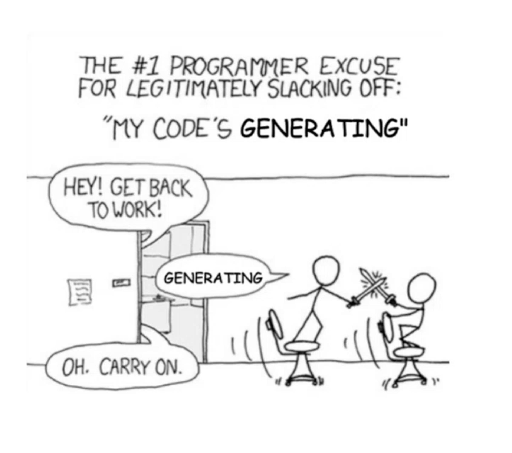
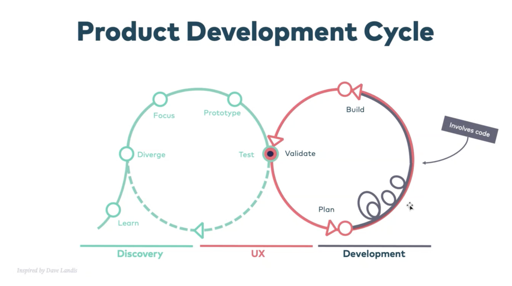

# Workshop Introduction: Agentic Software Engineering

Hello everyone, and thank you for taking the time to join us today.

Let's make the most of our time together and skip the traditional introduction round. While I'm genuinely interested in learning about your products and challenges, today's session is designed to serve your interests, not mine.

## About Your Facilitator

Let me share a bit about my background so you can decide whether the next 90 minutes will be valuable for you.

Developer experience has been my passion for many years. My mission has always been to maximize developer joy and productivity. Having started coding at age 9, I understand firsthand how crucial developer experience truly is.

Here's a story that illustrates where we're headed today: When I joined OTTO, everyone was using Eclipse. I brought IntelliJ IDEA with me. Initially, my colleagues were skeptical—some even laughed at me for not using Eclipse. But after some pair programming sessions and giving it time, the entire team had switched to IntelliJ.

### Why This Story Matters

We're at a similar inflection point today. Everyone is using the latest tools, but something fundamentally new is emerging. However, this time it's different:

- It's not about learning a new tool
- It's not about memorizing hotkeys, buttons, or features
- **It's about transforming how we work**

This transition is much more profound and challenging.

---

## What to Expect

Over the next 90 minutes, I'll demonstrate how I've transformed my way of working—both practically and theoretically.

### What You'll Gain

- **Understanding of the new developer experience** - You'll see exactly how this paradigm shift looks in practice
- **Clarity on what makes this transition different** - Why it's more than just learning new tools
- **A concrete starting point** - Practical knowledge to begin this transformation with your own teams

### Format

- **No slides during the session** - Slides don't foster conversation, and I want this to be interactive
- **Please interrupt me** - Be critical, ask questions, challenge assumptions
- **This is a dialogue, not a lecture** - Your participation makes this valuable
- **Slides, recording, and transcript will be shared afterward** for you to distribute to colleagues
- **Live demonstrations** of actual implementation
- **No prerequisites needed** - Just listen, think, and debate

### Important Note

This won't be a flashy demo with pretty visuals. We're developers, not UX designers. My goal is to show you how to write high-quality code at scale. This means:

- Some parts may seem routine or even boring
- We'll initiate code generation processes and use the time to discuss the theory and what's happening behind the scenes
- **This is the productivity paradigm in action**: Instead of watching code being typed, we'll use generation time productively—exactly how you should work with these tools
- The focus is on practical, real-world application



### Scaling Considerations

**Today's demonstration shows a single developer using a single agent.** In real-world scenarios, you would scale this approach:

- Multiple agents running in parallel
- Working on different features simultaneously
- Operating across the same repository

I trust you have the imagination to envision this multiplied across your team. However, following multiple parallel processes in a presentation creates excessive cognitive load and makes it difficult to understand the concepts. During the theory portion, I'll address:

- How to achieve this level of autonomy
- Managing the new cognitive challenges, particularly **review fatigue**
- Strategies for effectively orchestrating multiple agents

### Let's Begin

Now, let's have Claude Code start implementing a new feature while we explore my perspective on Agentic Software Engineering and how it's reshaping our profession.

This isn't just a demo—it's a glimpse into how we'll all be working in the near future. Ready to see what that looks like?

---

## Why Agentic Engineering Matters: The Developer Reality

### The Current Developer Pain Points

Before we dive into solutions, let's acknowledge where we are today:

**Legacy Systems Challenges**:

- Outdated codebases with limited documentation
- Technical debt accumulated over years
- Complex deployment processes that few understand
- Dependencies on technologies that are hard to maintain

**Knowledge Management Crisis**:

- Lack of comprehensive documentation
- Lost institutional knowledge when team members leave
- Implicit knowledge that lives only in developers' heads
- Difficulty onboarding new team members

**Overwhelming Workload**:

- Endless feature requests from stakeholders
- High pressure to deliver faster with fewer resources
- Context switching between multiple projects
- Burnout from repetitive, tedious tasks

**The Resource Reality**:

- Teams losing experienced developers
- Difficulty hiring skilled engineers
- Budget constraints limiting team growth
- Skills gaps in modern technologies

### What Developers Actually Want

When we ask developers what would truly help them, they consistently tell us:

**Accelerate the Development Process**:

- Faster implementation of well-defined features
- Reduced time spent on boilerplate and repetitive code
- Quick prototyping and experimentation capabilities
- Automated testing and quality assurance

**Better Requirements Engineering**:

- Clear, actionable specifications
- Automated analysis of existing systems
- Help translating business needs into technical requirements
- Documentation that stays current with code changes

**Development Process Support**:

- Intelligent code reviews and suggestions
- Automated refactoring and optimization
- Consistent coding standards across teams
- Knowledge sharing and documentation automation

**Testing and Infrastructure Assistance**:

- Automated test generation and maintenance
- Infrastructure as code and deployment automation
- Performance monitoring and optimization
- Security scanning and compliance checking

### The Promise of Agentic Engineering

Agentic engineering addresses these pain points not by replacing developers, but by elevating them from implementers to orchestrators. Instead of writing every line of code, you guide AI agents to handle the routine work while you focus on:

- **Strategic decisions** about architecture and design
- **Complex problem-solving** that requires human insight
- **Cross-team collaboration** and stakeholder communication
- **Innovation and creativity** in product development

This isn't about making developers obsolete—it's about making them more effective, fulfilled, and capable of handling the challenges that truly matter.

---

## Understanding Agentic Coding

### The Evolution from Assisted to Agentic

Understanding the distinction between **assistants** and **agents** is crucial for leveraging the full potential of AI-powered development.

#### Assisted Coding (Workflows) - You remain the driver:

**Context Management**:

- You manually craft and curate context
- You explicitly select which files to include
- Context management is your responsibility
- Manual context switching between tasks

**Memory & Learning**:

- No memory between sessions
- You must re-establish context each time
- No learning from past interactions
- Stateless interactions

**Tool Usage**:

- Limited, predefined tool access
- You must explicitly request tool usage
- Tools don't chain together autonomously
- Manual coordination of different tools

**Feedback Loop**:

- Human remains in the loop at every step
- Manual verification and correction required
- You decide each next action
- Reactive to your direct commands

**Examples**: Zed, Windsurf, Cursor, VS Code extensions, Cline

#### Agentic Coding (Autonomous) - AI takes the initiative:

**Context Management**:

- Automatically creates and maintains context
- Self-directed context discovery and expansion
- Intelligent file selection based on relevance
- Dynamic context adaptation as work progresses

**Memory & Learning**:

- Short-term and long-term memory by default
- Learns from previous sessions and decisions
- Builds knowledge about your project over time
- Maintains state across interactions

**Tool Usage**:

- Liberal, autonomous tool usage
- Tools chain together intelligently
- Proactive tool selection based on needs
- Self-coordinated multi-tool workflows

**Feedback Loop**:

- Self-directed feedback loops
- Self-corrects based on error messages and test results
- Makes autonomous decisions about task completion
- Proactive problem-solving and optimization

**Examples**: Claude Code, OpenAI Codex, Open Code, Gemini CLI

#### The Critical Difference: Ownership vs. Orchestration

- **Assisted Coding**: You own every decision, AI executes your commands
- **Agentic Coding**: You set goals and constraints, AI owns the implementation path

This evolution mirrors how we moved from manual deployments to CI/CD pipelines—from controlling every step to defining outcomes and letting automation handle the details.

### The 8 Levels of Agentic Engineering 🪜

> **Key Insight**: Each level represents a 2-4x productivity multiplier when mastered

**Level 1: Manual Code Writing** 🐌

- Traditional development without AI assistance
- Time: 2-4 hours for basic CRUD endpoint
- ROI: 1x (baseline)

**Level 2: Single-Line Autocomplete** ✨

- Tools: GitHub Copilot, Tabnine
- Time Saved: 15-20%
- ROI: 1.2x

**Level 3: Multi-Line Autocomplete** 📄

- Tools: GitHub Copilot, Claude in IDE
- Time Saved: 30-40%
- ROI: 1.5x

**Level 4: Manual Single Agent** 🤖

- Tools: Claude Code, Cursor, Windsurf
- Time Saved: 60-70%
- ROI: 2.5x
- **Junior Developer Parallel**: Like working with a talented junior who needs guidance

**Level 5: Manual Single-Role Multi-Agent** 👥

- Specialized agents for UI, logic, and testing
- Time Saved: 70-80%
- ROI: 3.0x

**Level 6: Manual Multi-Role Multi-Agent** 🌐

- Full cross-functional team simulation
- Time Saved: 80-85%
- ROI: 3.5x

**Level 7-8: Autonomous Agents** ⚡🚀

- Self-organizing and strategic decision making
- ROI: 4.0x
- Currently experimental for most teams

Think of it as evolving from hiking → horse & carriage → rally driving. Each mode has its place, but the speed and requirements change dramatically.

**The Rally Driver Analogy**: Like a rally driver, you need:

- Pre-charted routes (clear requirements)
- A skilled co-pilot giving directions (you guiding the AI)
- The ability to maintain focus at high speed
- Quick decision-making when obstacles appear

**Warning**: After 6-8 hours of agentic coding, you're exhausted. You might push 7,000 lines of code in a day, but the cognitive load is intense.

---

## Context: The Critical Challenge

### Why Context Matters

Context is like working memory for AI—it holds:

- System prompts and instructions
- Current state and progress (short-term memory)
- Retrieved information and documentation
- Available tools and capabilities
- User prompts and responses
- Code understanding and project structure


### Common Context Problems

- **Overflow**: Information gets lost as context fills up
    - Early models would forget the beginning of long poems
    - Now mitigated by compression and summarization

- **Distraction**: New information overwrites important guidelines
    - Coding style preferences get forgotten
    - Quality standards slip away

- **Poisoning**: Wrong information gets stuck
    - Old ideas resurface repeatedly
    - Incorrect assumptions persist

- **Confusion**: Conflicting information causes errors
    - Mixed naming conventions
    - Contradictory instructions

- **Context Rot**: Discrepancies between AI's understanding and reality
    - Files changed outside the AI's view
    - Assumptions about code state that are outdated

**Key Insight**: When follow-up responses get worse than the first one, your context is likely compromised. Start fresh!

### Managing Context Effectively

**Short-term Memory**:

- Managed by agents automatically
- Compresses and summarizes between sessions
- Hands off critical information to next context window

**Long-term Memory**:

- Markdown files in your project
- `/docs` folder with specifications
- Project conventions and guidelines
- Requirements and architectural decisions
- Advanced: Using knowledge graphs instead of files

---

## Tool Landscape

### Claude Code (Our Choice)

- CLI tool: `npm install -g @anthropic-ai/claude-code`
- Requires subscription
- Integrates with VS Code, JetBrains
- Excellent context management
- Best-in-class for long sessions

### Why Claude Code?

- Superior context retention
- Better at following guidelines
- More consistent output
- Understands project structure
- Less context decay over time

### Tool Selection Matrix 📋

| Tool               | Agentic Level | Strengths                          | Best For            | Cost         |
|--------------------|---------------|------------------------------------|---------------------|--------------|
| **GitHub Copilot** | 2-3           | IDE integration, Fast autocomplete | Daily coding        | $10-19/mo    |
| **Claude Code**    | 4-6           | Full context, MCP ecosystem        | Feature development | $20/mo       |
| **Cursor**         | 4-5           | VSCode fork, Built-in chat         | VSCode users        | $20/mo       |
| **Windsurf**       | 4-6           | Multi-agent workflows              | Complex projects    | $25/mo       |
| **Aider**          | 3-4           | Git-native, Terminal-based         | Git workflow        | Model costs  |
| **TaskMaster AI**  | 5-7           | Project orchestration              | Large projects      | Free/Premium |

### Model Comparison 🤖

| Model               | Coding Strength | Context Window | Best Use Case           |
|---------------------|-----------------|----------------|-------------------------|
| **Claude Sonnet 4** | ⭐⭐⭐⭐⭐           | 200K           | Complex reasoning       |
| **Kimi K2**         | ⭐⭐⭐⭐            | 128K           | General development     |
| **Gemini 2.5 Pro**  | ⭐⭐⭐             | **1M**         | Large codebase analysis |

### MCP Integration Ecosystem

- **GitHub Integration**: Direct repository access, PR creation
- **TaskMaster AI**: Project orchestration and task breakdown
- **Memory Systems**: Persistent knowledge graphs
- **External Tools**: Puppeteer, MongoDB, Notion, Slack

---

## BREAK

---

## Product Development Life Cycle



---

## The Power of Documentation

### Why Documentation Is Essential

Remember: The AI doesn't have the implicit knowledge that lives in your team's heads. Documentation fills this critical gap.

##### What to Document

1. Understand the application (technically)
2. Extract the essence of the domain
3. Document requirements along the way
4. Have a backlog ready for development
5. Create a prototype to test assumptions

###### 1. Understand the application (technically)

- Architecture Reviews
- Project Archaeology
- Code Analysis & Comprehension
- Read Documentation
- Tech Stack Canvas

1.1. **Technical Specifications**

- API documentation
- Database schemas
- Integration points
- Deployment architecture

1.2. **Coding Standards and Conventions**

- Naming conventions
- File structure
- Testing approach
- Code style guidelines

###### 2. Extract the essence of the domain

- Product Vision
- Product Requirements Documents
- Glossary / Ubiquitous Language
- Domain Story Telling
- Talk to people

2.1. **Product Requirements Documents (PRD)**

- Product vision and goals
- Target audience
- Success metrics
- Technical scope
- Stakeholder information

2.2. **Domain Glossary**

- Core business terms
- Entity relationships
- Ubiquitous language (DDD style)
- Business rules

###### 3. Document requirements along the way

- Jobs to be done
- Proto-Personas
- User Journeys & Flows
- Information Architecture
- Interaction Patterns
- Design System

3.1. **Personas and User Journeys**

- Who uses your product
- Their goals and pain points
- How they flow through your application
- Critical touch points

3.2. **Information Architecture**

- Site structure/navigation
- Component hierarchy
- Page relationships
- Data flow

###### 4. Have a backlog ready for development

- User Story Maps
- User Stories

###### 5. Create a prototype to test assumptions

- Rules & Conventions
- Story Planning
- Implementation

**The Magic**: Well-structured, linked documentation allows the AI to navigate and find exactly what it needs—just like a new team member would.

### Documentation Best Practices

- Use markdown files in your repository
- Create a `/docs` folder with clear structure
- Each folder should have a README explaining its contents
- Use links between documents for easy navigation
- Keep documentation close to code (not in Confluence!)
- Make it accessible to both humans and AI

**Pro Tip**: The AI can generate much of this documentation by analyzing existing code—but you must review and refine it!

---

## Practical Workflow

### Overview: From Chaos to Clarity

The practical workflow transforms your development process from reactive coding to proactive engineering. We'll cover three interconnected phases that build upon each other:

1. **Foundation**: Treating AI as a junior developer who needs mentoring
2. **Preparation**: Setting up requirements and documentation for success
3. **Execution**: Implementing with quality controls and continuous improvement

Each phase is crucial—skip one, and the entire system breaks down.

---

### Phase 1: The Teaching Mindset 🎓

**Core Principle**: Think of AI as Interns—talented, eager to learn, but requiring guidance, verification, and mentoring to produce production-quality work.

#### Why Teaching Works Better Than Commanding

When you simply tell an AI "implement authentication," you get generic, often inappropriate solutions. But when you guide it through understanding your specific context, patterns, and requirements, you get production-quality code that fits your architecture.

#### The Teaching Framework

**For Single Agent (Level 4)**:

- **Ask First**: "What do you understand about our current authentication patterns?"
- **Provide Context**: Share architectural decisions and security requirements
- **Guide Discovery**: "How would you approach integrating this with our user management?"
- **Validate Understanding**: "What security considerations should we address?"
- **Iterative Feedback**: Review output and provide specific improvements

**For Multi-Agent Teams (Level 5-6)**:

- **Cross-Training**: Ensure each agent understands the others' domains
- **Consistency Enforcement**: Maintain architectural coherence across specializations
- **Integration Focus**: Verify components work together seamlessly
- **Progressive Complexity**: Start with simple tasks, gradually increase scope

#### Real Example: Authentication Feature

```bash
# Bad: Command approach
"Implement OAuth2 authentication"

# Good: Teaching approach
"Let's implement OAuth2 authentication. First, review our existing auth patterns in /docs/security.md. What approach would best integrate with our current session management? Consider our mobile app requirements."
```

The teaching approach yields:

- Context-aware implementation
- Consistent patterns
- Fewer integration issues
- Learning that improves future tasks

#### The "AI as Interns" Mental Model 🎓

**Why This Framework Works**:

Just like with human interns, you wouldn't hand them a critical production task without guidance and expect perfect results. AI agents require the same thoughtful management approach.

**Intern Characteristics That Apply to AI**:

- **Talented but inexperienced** with your specific domain and codebase
- **Eager to please** but may make assumptions if not guided properly
- **Capable of high-quality work** when given proper context and feedback
- **Need validation** of their understanding before proceeding
- **Learn from examples** and improve with consistent feedback

**Your Role as AI Mentor**:

- **Set clear expectations** about quality, patterns, and constraints
- **Provide examples** of good and bad implementations
- **Review their work** before it goes to production
- **Give specific feedback** rather than vague corrections
- **Never take results for granted** - always verify and validate

**Key Responsibilities**:

- **Verification is YOUR responsibility** - AI makes mistakes just like human interns
- **Quality control** - Check assumptions, validate security, test edge cases
- **Context management** - Ensure the AI has the right information to succeed
- **Continuous improvement** - Help the AI learn your preferences and patterns

**Remember**: Just like with human interns, the goal is to develop a productive working relationship where both parties learn and improve over time.

---

### Phase 2: Requirements Engineering 📋

**Transform vague ideas into AI-executable specifications**

#### The Requirements Pipeline

```
Vague Idea → User Story → Technical Requirements → AI-Ready Tasks
```

#### Step 1: Capture Requirements in AI-Digestible Format

**Traditional Approach** (fails with AI):

- Ticket: "Add password reset"
- Description: "Users should be able to reset their passwords"
- Acceptance: "It works"

**AI-Ready Approach**:

```markdown
## Feature: Password Reset Flow

### Context

- Current auth system uses JWT tokens
- Email service: SendGrid (see /docs/integrations/sendgrid.md)
- Security requirements: /docs/security/password-policy.md

### User Story

AS A registered user
WHEN I forget my password
THEN I can securely reset it via email

### Technical Requirements

1. Secure token generation (cryptographically random, 24hr expiry)
2. Rate limiting (3 attempts per hour per email)
3. Email template matching brand guidelines
4. Audit logging for security events
5. Mobile app deep-link support

### Acceptance Criteria

- [ ] Token cannot be reused
- [ ] Old password invalidated after reset
- [ ] Email sent within 30 seconds
- [ ] Works on mobile browsers
- [ ] Accessibility: WCAG 2.1 AA compliant
```

#### Step 2: Create Executable To-Do Lists

**Structure for Maximum Clarity**:

```markdown
## Epic: Password Reset Implementation

### Prerequisites

- [ ] Review security guidelines: /docs/security/password-policy.md
- [ ] Check email service docs: /docs/integrations/sendgrid.md
- [ ] Understand current auth flow: /docs/architecture/authentication.md

### Implementation Tasks

#### 1. Backend API (2-3 hours)

- [ ] 1.1 Create password reset token model
    - Secure random generation (32 bytes)
    - Expiry timestamp (24 hours)
    - One-time use flag
    - Reference: [Security Standards](#security)

- [ ] 1.2 Implement `/api/auth/reset-request` endpoint
    - Validate email exists
    - Generate secure token
    - Send reset email
    - Rate limiting implementation
    - Reference: [API Guidelines](#api-patterns)

- [ ] 1.3 Implement `/api/auth/reset-confirm` endpoint
    - Validate token and expiry
    - Update password with proper hashing
    - Invalidate all existing sessions
    - Log security event
    - Reference: [Audit Requirements](#logging)

#### 2. Frontend Flow (2-3 hours)

- [ ] 2.1 Create reset request form
    - Email validation
    - Loading states
    - Error handling
    - Reference: [Design System](#components)

- [ ] 2.2 Create reset confirmation form
    - Password strength indicator
    - Confirm password field
    - Success/error states
    - Reference: [Form Patterns](#forms)

#### 3. Testing & Security (1-2 hours)

- [ ] 3.1 Unit tests for token generation
- [ ] 3.2 Integration tests for full flow
- [ ] 3.3 Security test for token reuse
- [ ] 3.4 Load test for rate limiting
- [ ] 3.5 E2E test for user journey
```

#### Step 3: Preparation Investment

**Time Requirements**:

- Initial setup: 1-2 hours per epic
- Refinement during implementation: 30 minutes
- Total: ~2.5 hours of preparation for 6-8 hours of implementation

**ROI Calculation**:

- Traditional development: 16 hours (with back-and-forth, debugging, rework)
- With AI + Good Requirements: 2.5 hours prep + 6 hours implementation = 8.5 hours
- **Time saved: 47%**

---

### Phase 3: Implementation & Quality Control 🚀

#### The Development Loop

```
Plan → RED-GREEN-REFACTOR Cycle → Verify → Deploy
     ↑                              ↓         ↓
     ←━━━━━━━━━━━━━━━━━━━━━━━━━━━━━┴━━━━━━━━━┘
              Continuous Feedback

RED-GREEN-REFACTOR Cycle (All AI-Generated):
┌─────────────────────────────────────────────┐
│ 1. RED: Generate failing test               │
│    ↓                                        │
│ 2. Run test → ❌ (should fail)              │
│    ↓                                        │
│ 3. GREEN: Generate minimal code to pass     │
│    ↓                                        │
│ 4. Run test → ✅ (should pass)              │
│    ↓                                        │
│ 5. REFACTOR: Improve code (NOT tests)       │
│    ↓                                        │
│ 6. Run test → ✅ (should still pass)        │
│    ↓                                        │
│    → Continue to next test or Verify        │
└─────────────────────────────────────────────┘
```

**The TDD Process**:

- **RED**: AI generates a test that captures the requirement - it MUST fail initially
- **GREEN**: AI generates the minimal code needed to make the test pass
- **REFACTOR**: AI improves ONLY the implementation code quality while keeping tests green

**Key Insight**: The AI handles the entire TDD cycle, but you guide it with requirements and verify the final result.

#### Step 1: Strategic Implementation

**Start Your Day Right**:

```bash
# Morning setup (15 minutes)
1. Review the epic and to-do list
2. Run: claude --context=full --epic="password-reset"
3. Let AI analyze codebase and understand context
4. Discuss approach: "What's your implementation plan?"
```

**During Implementation**:

- Work on 2-3 tasks at a time (don't overload context)
- Watch the implementation in real-time
- Add comments/corrections as it codes
- Let it run tests and self-correct

**Pro Tips**:

- Morning sessions are most productive
- Take breaks every 2 hours (cognitive load is real)
- Don't interrupt unless it's going seriously wrong
- Trust the process but verify the output

#### Step 2: Automated Quality Gates

**Create `quality-review.md`**:

```markdown
## Automated Review Checklist

### Code Quality

- [ ] No code duplication (DRY principle)
- [ ] Functions < 20 lines
- [ ] Cyclomatic complexity < 10
- [ ] Meaningful variable names
- [ ] Proper error handling

### Security

- [ ] Input validation on all endpoints
- [ ] No hardcoded secrets
- [ ] Parameterized queries only
- [ ] Proper authentication checks
- [ ] Rate limiting implemented

### Performance

- [ ] Database queries use indices
- [ ] No N+1 query problems
- [ ] Pagination for large datasets
- [ ] Caching where appropriate
- [ ] Response time < 200ms

### Testing

- [ ] Unit test coverage > 80%
- [ ] Integration tests for APIs
- [ ] Edge cases covered
- [ ] Error scenarios tested
```

**Run Automated Review**:

```bash
claude --review --standards="quality-review.md" --fix-issues
```

#### Step 3: Human Review & Refinement

**What to Focus On**:

1. **Business Logic**: Does it actually solve the problem?
2. **Architecture Fit**: Does it follow your patterns?
3. **Edge Cases**: Are weird scenarios handled?
4. **Security**: Any potential vulnerabilities?
5. **Performance**: Will it scale?

**What to Ignore**:

- Minor style differences (let linters handle)
- Perfect variable names (good enough is fine)
- Micro-optimizations (premature optimization)

#### Step 4: The Feedback Loop

**Daily Improvements**:

```bash
# End of day retrospective
claude --analyze="today's commits" --improve="patterns,performance"
```

**Weekly Pattern Analysis**:

- What patterns is AI using repeatedly?
- What mistakes keep appearing?
- Update your guidelines and documentation
- Share learnings with the team

---

### Real-World Implementation Schedule

#### Day 1: Setup & First Feature

- **Morning (2 hours)**: Documentation review, requirements prep
- **Midday (3 hours)**: First feature implementation with AI
- **Afternoon (2 hours)**: Review, refactor, testing
- **End of day (30 min)**: Update docs, commit, retrospective

#### Day 2-5: Acceleration

- **Morning (30 min)**: Prep next epic
- **Day (6 hours)**: Implementation + continuous review
- **End of day (30 min)**: Documentation updates

#### Week 2+: Cruise Control

- Prep time reduces to 15-30 minutes per epic
- Implementation becomes predictable
- Quality improvements compound
- Team velocity stabilizes at 2.5-3.5x

---

### Configuration Best Practices

#### The `claude.md` File

Your project's AI instruction manual:

```markdown
# Project: E-Commerce Platform

## Overview

Modern e-commerce platform built with Next.js, Node.js, and PostgreSQL.
Target: 100k daily active users, sub-200ms response times.

## Architecture Patterns

- Clean Architecture with clear layer separation
- Repository pattern for data access
- CQRS for complex domains
- Event-driven for async operations

## Coding Standards

- TypeScript strict mode
- Functional components with hooks
- Async/await over promises
- Descriptive names over comments

## Key Conventions

- API routes: `/api/v1/resource`
- Database naming: snake_case
- TypeScript interfaces: PascalCase
- React components: PascalCase files

## Testing Strategy

- Unit tests for business logic
- Integration tests for APIs
- E2E tests for critical paths
- Minimum 80% coverage

## Common Patterns

See /docs/patterns/ for:

- Authentication flow
- Error handling
- Data validation
- API responses

## Do NOT:

- Use any; type (find proper types)
- Skip error handling
- Hardcode configuration
- Create giant functions
- Ignore accessibility
```

---

### Workflow Optimization Tips

#### Context Management

- Start fresh when quality degrades
- Use focused contexts for specific tasks
- Don't include unnecessary files
- Clear context between major features

#### Parallel Development

```bash
# Terminal 1: Backend API
claude --agent="backend" --feature="auth-api"

# Terminal 2: Frontend components
claude --agent="frontend" --feature="auth-ui"

# Terminal 3: Testing
claude --agent="tester" --feature="auth-tests"
```

#### Documentation as Code

- Treat docs like source code
- Version control everything
- Review doc changes in PRs
- Keep docs next to code
- Auto-generate when possible

---

### Measuring Success

#### Key Metrics to Track

**Velocity Metrics**:

- Stories completed per sprint
- Lines of code per day (be careful with this one)
- Features delivered per month
- Bug rates pre/post AI adoption

**Quality Metrics**:

- Code review feedback items
- Production bugs per feature
- Test coverage trends
- Performance benchmarks

**Team Metrics**:

- Developer satisfaction
- Onboarding time for new devs
- Knowledge sharing frequency
- Documentation completeness

#### Expected Progression

**Week 1**: 1.5x productivity, lots of learning
**Week 2-4**: 2x productivity, finding rhythm
**Month 2**: 2.5x productivity, smooth flow
**Month 3+**: 3-3.5x sustained productivity

Remember: This is a marathon, not a sprint. Sustainable pace beats burnout every time.

---

### Advanced Workflows & Personas

#### Agentic Workflows: Mirror Your Real Process 🔄

**Core Principle**: Audit your actual process, then create AI commands for each step

##### Feature Development Workflow (BDD/ATDD) 🛠️

```
🏁 START: User story provided

1. BDD ANALYSIS AGENT: "Define behavior and acceptance criteria"
   - Given/When/Then scenarios
   - Example mapping
   - Automated acceptance tests

2. GIT FLOW AGENT: "Prepare development environment"
   - Feature branch creation
   - Pre-commit hooks setup
   - PR template preparation

3. PARALLEL DEVELOPMENT:
   ┌─────────────┐        ┌─────────────┐
   │ 🏗️ ARCHITECT │        │ 🧪 TEST ENG  │
   │ • API design │        │ • Test first │
   │ • Data model │        │ • Fixtures   │
   └─────────────┘        └─────────────┘

   ┌─────────────┐        ┌─────────────┐
   │ ⚙️ BACKEND   │        │ 🎨 FRONTEND  │
   │ • Logic     │        │ • Components │
   │ • Database  │        │ • E2E tests  │
   └─────────────┘        └─────────────┘

4. CONTINUOUS QUALITY GATES:
   Pre-commit → Unit tests → Integration → Security → E2E

🏆 OUTPUT: Behavior-driven feature with comprehensive testing
```

#### Personas: Specialized AI Agents 🎭

**Why Personas Matter**:

- Cognitive specialization for domain expertise
- Consistent context and constraints
- Quality through specialization
- Team structure simulation

##### Technical Personas

```yaml
Frontend Specialist:
    - React/Vue/Angular expertise
    - Performance optimization
    - Accessibility standards

Backend Architect:
    - API design patterns
    - Database optimization
    - Security frameworks

DevOps Engineer:
    - CI/CD pipelines
    - Infrastructure as code
    - Monitoring strategies
```

##### Strategic Personas

```yaml
Product Manager:
    - Requirements analysis
    - User story creation
    - Stakeholder communication

Security Specialist:
    - OWASP guidelines
    - Threat modeling
    - Compliance requirements
```

---

### Productivity Hacks & Advanced Techniques 🎯

#### Self-Reflection & Continuous Improvement 🔄

**AI-Powered Retrospectives**:

```bash
# Weekly code health checks
claude --persona="reviewer" --task="analyze-recent-commits"
```

- Automated pattern identification
- Technical debt assessment
- Performance regression detection

#### Token Efficiency & Cost Optimization ⚡

**Smart Context Management**:

```bash
# Only include relevant context
claude --context-filter="modified-files,dependencies" \
       --exclude="node_modules,build"
```

**Batch Operations**:

- Combine related tasks in single requests
- Template reuse for common patterns
- Smart caching of AI responses

#### Error Pattern Recognition 🔍

**Common Patterns Database**:

```yaml
Authentication Issues:
    Pattern: Missing JWT validation
    Fix: Security middleware templates

Performance Problems:
    Pattern: N+1 queries
    Fix: Query optimization guides
```

#### Advanced Prompt Engineering 🧠

**Chain-of-Thought**:

```
Instead of: "Fix this bug"
Use: "Analyze step by step:
1. What's the expected behavior?
2. What's actually happening?
3. What's the root cause?
4. How should we fix it?"
```

**Role-Based Prompting**:

```
"As a senior security engineer,
review this authentication and
identify OWASP vulnerabilities"
```

#### Productivity Multipliers 🚀

**Hot-Reloading Development**:

```bash
claude --watch --auto-fix --persona="reviewer"
```

**Template-Driven Development**:

```bash
claude --template="react-component" \
       --props="name,onSubmit,validation"
```

**Multi-Agent Workflows**:

```bash
claude --agents="frontend,backend,tester" \
       --feature="user-auth"
```

#### Quality Metrics & Monitoring 📊

**Automated Tracking**:

- Code complexity trends
- Security vulnerability scanning
- Performance regression detection
- Team velocity analytics

**ROI Measurement**:

- Feature delivery speed
- Bug reduction rates
- Code quality improvements
- Developer satisfaction

---

## Real Performance Data

From our actual project metrics:

### The Timeline

**Phase 1 - Traditional Development**:

- ~100% time overrun
- Team challenges and layoffs
- Infrastructure issues
- Estimated 20% overrun even without team issues

**Phase 2 - Claude Code Adoption (Jan-Apr)**:

- 25-30% time saved
- Coding improved significantly
- But bottlenecks appeared elsewhere
- Empty backlogs became the problem

**Phase 3 - Full Process Optimization**:

- 75% time saved (completing in 25% of planned time)
- Entire increments done in days not weeks
- Zero issues in User Acceptance Testing
- Hundreds of unbilled hours (a new problem!)

### What Changed

1. **Removed ALL bottlenecks**, not just coding
2. **Improved planning** and epic preparation
3. **Clear strategy** and decision-making
4. **"Slightly more waterfall"** - having a plan matters
5. **Faster backlog filling** to keep pace

**New Reality**: Developers consume stories faster than Product Owners can write them!

---

## What AI Excels At

### ✅ Great for:

**Boilerplate and Standard Patterns**

- CRUD operations
- API endpoints
- Data models
- Service layers

**Integration Work**

- Reading API documentation
- Implementing OpenAPI specs
- Connecting services
- Data transformations

**Testing**

- Unit test generation
- Mock setup (the painful part!)
- Test data creation
- Coverage improvement

**Documentation**

- Code documentation
- API documentation
- README files
- Architecture diagrams (C4, Mermaid)

**Infrastructure as Code**

- Docker configurations
- Kubernetes manifests
- Terraform scripts
- CI/CD pipelines

**Maintenance Tasks**

- Code reviews
- Bug fixing
- Refactoring
- Performance optimizations

### ❌ Struggles with:

**Complex Architecture**

- System design decisions
- Microservice boundaries
- Technology selection
- Scaling strategies

**Concurrent Programming**

- Race conditions
- Thread safety
- Async coordination
- Event-driven architectures

**Domain-Specific Logic**

- Business rule edge cases
- Industry-specific algorithms
- Regulatory compliance
- Complex calculations

**Workarounds**: For concurrency issues, have it write comprehensive tests and analyze log files to understand timing problems.

---

## Common Anti-Patterns

### The "Daddy" 👨‍💼

**Characteristics**:

- Endless debates about the "right way"
- Long discussions about coding philosophy
- Inflexible about alternative approaches
- Clutters context with opinions
- Forgets the actual task at hand

**Psychology**: Often emerges under pressure or when dealing with unfamiliar AI capabilities. The need to maintain authority conflicts with AI's autonomous decision-making.

**Fix**: Stay focused on outcomes, not process. Remember: You're not teaching a junior developer—you're orchestrating a specialized tool.

### The "Flip-Flopper" 🎭

**Characteristics**:

- Changes direction at first obstacle
- "Let's try something completely different!"
- Never follows through on solutions
- Creates a "wiggly line" of attempts
- Confuses AI with contradictory instructions

**Psychology**: Often a victim of the "TikTok effect"—unable to hold course when faced with complexity. The speed of AI responses can exacerbate this tendency.

**Fix**: Stick with one approach and iterate. Remember that even good solutions need refinement, not replacement.

### The "Speed Demon" 🏃

**Characteristics**:

- Can't keep up with context changes
- Uses wrong class/service names
- Jumps between detail levels
- Gets disoriented by rapid changes
- Mixes old and new terminology

**Psychology**: Overwhelmed by the speed of AI-driven development. The inference time can feel too long, leading to impatience and hasty decisions.

**Fix**: Slow down and maintain consistency. Use the AI's generation time productively for thinking and planning, not rushing to the next task.

### The "Silent Type" 🤐

**Characteristics**:

- Provides minimal information
- Forces AI to guess intent
- Expects mind reading
- Gets frustrated with results
- "It should know what I mean!"

**Psychology**: Problems with explaining context and requirements. Often assumes the AI has more context than it actually does.

**Fix**: Over-communicate, especially context. Remember: LLMs need explicit information—they can't read your mind or infer unstated requirements.

### The "Inflexible" 🔒

**Characteristics**:

- Engages in long discussions about methodology
- Insists on only one "correct" solution
- Fills context with personal opinions and philosophy
- Tends to forget the actual goal
- Resists alternative approaches suggested by AI

**Psychology**: Often stems from deep technical expertise combined with fear of losing control. Senior developers are particularly susceptible to this pattern.

**Fix**: Focus on outcomes, not methods. Let AI explore different approaches and evaluate results pragmatically.

### The "Disoriented" 😵‍💫

**Characteristics**:

- Gets challenged by the speed of AI generation
- Has difficulty connecting different implementation steps
- Struggles with switching between detail levels
- Provides confusing or contradictory prompts
- Can't maintain coherent direction across iterations

**Psychology**: Cognitive overload from trying to manage both high-level strategy and low-level implementation simultaneously.

**Fix**: Work at one abstraction level at a time. Use structured workflows and clear checkpoints. Take breaks when feeling overwhelmed.

### Key Lessons from Anti-Patterns

**Universal Insights**:

- These patterns often emerge under pressure or when dealing with unfamiliar territory
- Senior developers aren't immune—expertise can sometimes work against adaptation
- Self-awareness is the first step to avoiding these traps
- Team dynamics and peer support play crucial roles in successful adoption

**Remember**: AI amplifies both good and bad habits. The key is developing new habits specifically for AI collaboration, not just applying old habits faster.

### Barriers to Level Progression 🚫

**The Review Challenge**

- Problem: Higher-level agents produce more code than humans can review
- Solution: Automated quality gates, AI-powered review agents, focus on business logic

**Cognitive Load Paradox**

- Problem: Managing multiple agents can be more complex than coding
- Solution: Start with Level 4, use orchestration tools, develop clear personas

**Trust & Control Issues**

- Problem: Fear of losing control over code quality
- Solution: Gradual delegation, clear boundaries, transparent logging

**Tool Integration Complexity**

- Problem: Each level requires sophisticated toolchains
- Solution: Use integrated platforms, start with pre-configured setups

**Team Adoption Resistance**

- Problem: Team members at different AI comfort levels
- Solution: Pair programming, success showcases, gradual rollout

### Key Lessons

- These patterns often emerge under pressure
- Senior developers aren't immune
- Self-awareness is critical
- Team dynamics matter

---

## Key Success Factors

### 1. **Clear Strategy**

- Know your destination
- Document architectural decisions
- Define success criteria
- Communicate vision clearly

### 2. **Prepared Backlog**

- Stay 2-3 epics ahead
- Write detailed requirements
- Include acceptance criteria
- Link all relevant documentation

### 3. **Quality Standards**

- Define clear guidelines
- Automate reviews
- Never compromise
- Maintain upward trajectory

### 4. **Team Adoption**

- Address resistance early
- Provide training and support
- Share success stories
- Create positive dynamics

### 5. **Process Evolution**

- Adapt entire workflow
- Address new bottlenecks
- Evolve role responsibilities
- Measure and iterate

### 6. **Change Management**

- Include all stakeholders
- Management buy-in essential
- User involvement critical
- Product owners must adapt

**Critical Insight**: Your backlog will empty faster than ever before. Product owners and requirements engineers need to adapt to this new pace.

### The Human Cost

- **Isolation**: Developers talk to AI more than teammates
- **Bus Factor**: Knowledge gets siloed
- **Fatigue**: High cognitive load from context switching
- **Resistance**: Not everyone adapts easily

**Solutions**: Regular team syncs, documentation reviews, pair programming sessions, gradual adoption

---

## Change Management & Team Dynamics: The Critical Success Factor 🔄

### Understanding Resistance Patterns

The transition to agentic engineering isn't just a technical challenge—it's fundamentally a human and organizational one. Understanding why people resist helps us address concerns effectively.

#### Teams with Resistance: Common Patterns

**Fear of Change**:

- Concern about job security and relevance
- Uncertainty about new role definitions
- Anxiety about keeping up with rapid technological evolution
- Fear of losing control over familiar processes

**Lack of Support**:

- Insufficient training and onboarding resources
- Missing leadership buy-in and clear vision
- Inadequate time allocated for learning and experimentation
- No clear success metrics or progression paths

**Isolated Working**:

- Developers increasingly interact with AI rather than teammates
- Reduced knowledge sharing and collaboration
- Loss of mentoring opportunities for junior developers
- Risk of creating knowledge silos

**Compensation in Team Communication**:

- Need for more structured team coordination
- Increased importance of documentation and written communication
- Required investment in team rituals and knowledge sharing
- Balancing individual productivity with team cohesion

### Change Management: The Underestimated Challenge

**Why Change Management is Critical**:

- Technical adoption without cultural shift leads to suboptimal results
- Tool proficiency doesn't automatically translate to productivity gains
- Resistance can undermine even technically successful implementations
- Team dynamics significantly impact overall success

**Common Change Management Mistakes**:

- Assuming technical training is sufficient
- Underestimating the time required for meaningful adoption
- Ignoring emotional and psychological aspects of change
- Failing to address varying comfort levels within teams

#### Team Dynamics: The Critical Variable

**Successful Team Characteristics**:

- **Psychological Safety**: Team members feel safe to experiment and fail
- **Collaborative Learning**: Shared exploration of new tools and techniques
- **Clear Role Evolution**: Understanding how roles change, not disappear
- **Balanced Adoption**: Mix of early adopters and thoughtful skeptics

**Warning Signs of Poor Dynamics**:

- Silent resistance or passive compliance
- Knowledge hoarding by early adopters
- Generational or experience-level divides
- Lack of shared standards and practices

### Overcoming Obstacles

#### Individual Challenges

**Varying Performance Increases**:

- Not everyone will see the same productivity gains
- Some developers adapt faster than others
- Different personality types respond differently to AI collaboration
- **Solution**: Personalized learning paths and peer mentoring

**AI Rejections and Skepticism**:

- Some team members may fundamentally resist AI assistance
- Concerns about code quality and maintainability
- Preference for "pure" human coding
- **Solution**: Start with documentation and testing—less controversial entry points

**Individual Learning Curves**:

- Different backgrounds and experience levels
- Varying comfort with new technologies
- Different learning styles and preferences
- **Solution**: Multiple learning modalities and flexible adoption timelines

#### Team-Level Solutions

**Gradual Rollout Strategy**:

1. **Pilot Phase**: Start with 1-2 volunteers on non-critical projects
2. **Showcase Phase**: Demonstrate concrete wins to build momentum
3. **Expansion Phase**: Gradually expand to willing team members
4. **Integration Phase**: Make AI assistance standard practice

**Success Story Development**:

- Document and share concrete productivity improvements
- Celebrate early wins and learn from failures
- Create internal champions and advocates
- Build evidence base for broader organizational buy-in

**Peer Learning Networks**:

- Pair programming sessions with AI tools
- Regular demo sessions of new techniques
- Cross-team knowledge sharing
- Communities of practice within organization

### Organizational Support Requirements

**Management Buy-In**:

- Understanding of the investment required
- Patience with initial productivity dips
- Support for experimentation and learning
- Clear communication of strategic vision

**Resource Allocation**:

- Time for learning and experimentation
- Budget for tools and training
- Infrastructure for new workflows
- Ongoing support and coaching

**Cultural Adaptation**:

- Redefining success metrics and productivity measures
- Adjusting performance evaluation criteria
- Creating new career development paths
- Fostering culture of continuous learning

### Creating Positive Team Dynamics

**Establishing New Rituals**:

- **AI Standup**: Weekly sharing of AI productivity wins and challenges
- **Code Review 2.0**: Reviewing AI-generated code with new quality criteria
- **Learning Lunches**: Informal sharing of new techniques and tools
- **Retro-Engineering**: Analyzing what worked and what didn't in AI collaboration

**Knowledge Sharing Mechanisms**:

- Internal documentation of effective prompts and workflows
- Video recordings of successful AI collaboration sessions
- Shared libraries of reusable AI commands and configurations
- Cross-pollination between teams at different adoption levels

**Maintaining Human Connection**:

- Regular face-to-face collaboration sessions
- Explicit time for mentoring and knowledge transfer
- Team projects that require human creativity and collaboration
- Social activities that strengthen team bonds

---

## Summary: The New Reality

Agentic coding isn't just faster coding—it's a fundamental shift in how we work:

### From → To

- Writing code → Orchestrating AI
- Empty backlogs → Overflowing possibilities
- Technical bottlenecks → Requirements bottlenecks
- Individual work → Even more isolated work (careful!)
- 2-week sprints → 2-day epics
- Code reviews → Architecture reviews
- "How to build" → "What to build"
- Individual engineer → Leader of AI "engineers"

### The Winners Will:

- Adapt entire processes, not just coding
- Invest in documentation and requirements
- Maintain quality standards religiously
- Build new team dynamics
- Embrace the paradigm shift fully
- Master the teaching approach with AI

### The New Challenges:

- Billing models (for consultancies)
- Career development paths
- Knowledge management
- Team collaboration
- Quality at scale
- Review fatigue at higher levels

### Critical Reminders Before You Begin

**ALWAYS REMEMBER: AI Makes Mistakes** 🚨

- AI makes errors just like human interns would
- Quality control, security validation, and testing are non-negotiable

**Team Adoption Is Make-or-Break**:

- Technical training alone is insufficient for success
- Change management is as important as tool selection
- Resistance patterns are predictable and addressable
- Individual productivity gains don't automatically translate to team success

### Resources to Continue Learning:

#### 🟢 Beginner

- https://claudelog.com/
- https://docs.anthropic.com/en/resources/prompt-library/library
- https://github.com/innoq/aimer - Advanced AI methodology and engineering practices
- https://devopstoolkit.live/ai/my-workflow-with-ai-how-i-code-test-and-deploy-faster-than-ever/
- https://github.com/vfarcic/youtube-automation
- https://kiro.dev/ - AI development platform
- https://learnprompting.org/docs/introduction - Prompt engineering fundamentals
- https://www.promptingguide.ai/ - Comprehensive prompting guide
- https://docs.anthropic.com/en/docs/build-with-claude/prompt-engineering/overview - Claude prompt engineering
- https://github.com/sst/opencode - Open source development framework
- https://mistral.ai/products/mistral-code - Mistral's coding AI model
- https://jules.google/ - Google's advanced AI development tools

#### 🟡 Intermediate

- https://github.com/bmadcode/BMAD-METHOD - Development methodology framework
- https://github.com/coleam00/context-engineering-intro
- https://www.task-master.dev/
- https://github.com/kingler/n8n_agent/tree/main/.claude/commands
- https://github.com/NomenAK/SuperClaude
- https://github.com/steipete - Personal profile with Claude Code projects
- https://github.com/steipete/claude-code-mcp - Claude Code MCP examples
- https://github.com/ruvnet/claude-flow - AI workflow orchestration
- https://github.com/The-Pocket/PocketFlow - Workflow automation framework
- https://mobbin.com/ - UI/UX design inspiration
- https://magicui.design/ - React UI component library
- https://tweakcn.com/ - UI development tools
- https://reactbits.dev/ - React component collection
- https://www.motiff.com/ - Collaborative design platform
- https://github.com/nsthorat/claude-playwright-cookie-copy - Advanced browser automation utilities

#### 🔴 Advanced

- [MCP Code Analysis](https://github.com/johannhartmann/mcpcodeanalysis) - Advanced analysis patterns
- [Claude Squad](https://github.com/smtg-ai/claude-squad) - Multi-agent orchestration
- [Claude Squad Documentation](https://smtg-ai.github.io/claude-squad/) - Implementation guides

#### MCP Server Installation Commands

Quick reference for setting up MCP servers with Claude Code:

```bash
# Documentation and research
context7: npx -y @upstash/context7-mcp

# Task and project management
taskmaster-ai: npx -y --package=task-master-ai task-master-ai

# Advanced reasoning and analysis
sequential: npx -y @modelcontextprotocol/server-sequential-thinking

# Database integration
mongodb: npx -y mongodb-mcp-server --connectionString mongodb://localhost:27017/products

# Knowledge management
cognee: uv --directory /Users/bstemmildt/opt/cognee/cognee-mcp run cognee

# Productivity integrations
notion: npx -y @gabornyerges/mcp-notion-server
github: npx -y @modelcontextprotocol/server-github

# Browser automation and testing
playwright: npx @playwright/mcp@latest
```

Ready to join the future of software development? The tools are here. The question is: Can your organization adapt fast enough?

*"The future belongs to those who can effectively collaborate with AI. Start your agentic engineering journey today."*
