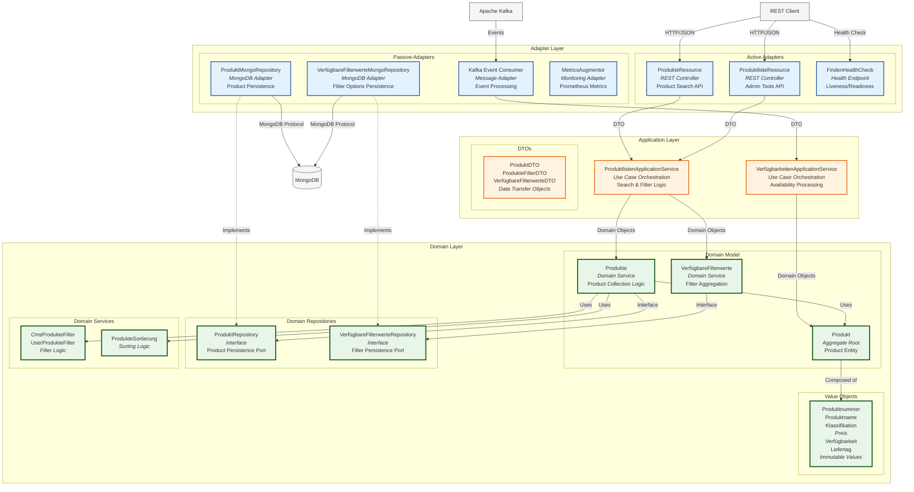

# Component Diagram - Finden Backend Service

## Overview

The Component diagram zooms into the Quarkus Backend container to show its internal structure. The backend follows an Onion/Hexagonal architecture with Domain-Driven Design principles, ensuring clear separation of concerns and maintainability.

## Component Diagram - Backend Service

## Layer Descriptions

### Domain Layer (Core)

The innermost layer containing pure business logic with no external dependencies.

#### Domain Model
- **Produkt** (Aggregate Root)
  - Central entity representing a product
  - Maintains business invariants
  - Composed of value objects
  - Methods: `validate()`, `applyDiscount()`, `checkAvailability()`

- **Produkte** (Domain Service)
  - Collection-level operations on products
  - Implements complex business rules
  - Methods: `search()`, `filter()`, `sort()`, `aggregate()`

- **VerfügbareFilterwerte** (Domain Service)
  - Aggregates available filter options
  - Calculates filter counts
  - Methods: `extractFromProducts()`, `groupByCategory()`

#### Value Objects (Immutable)
- **Produktnummer**: Product identifier with validation
- **Produktname**: Product name with length constraints
- **Klassifikation**: Category hierarchy (KlassifikationId, KlassifikationName)
- **Preis**: Price with currency and discount information
- **Verfügbarkeit**: Stock status and delivery information
- **Liefertag**: Delivery date calculations
- **Produktfarbe**: Color information with validation
- **ProduktbildUrl**: Image URL with protocol validation

#### Domain Repositories (Interfaces)
- **ProduktRepository**
  - `findByFilter(filter: ProdukteFilter): List<Produkt>`
  - `findByIds(ids: List<Produktnummer>): List<Produkt>`
  - `save(produkt: Produkt): Produkt`
  - `deleteById(id: Produktnummer)`

- **VerfügbareFilterwerteRepository**
  - `findAvailableFilters(products: List<Produkt>): VerfügbareFilterwerte`
  - `findPriceRanges(): List<PreisBereich>`

#### Domain Services
- **CmsProdukteFilter**: CMS-driven filter configurations
- **UserProdukteFilter**: User-selected filter criteria
- **ProdukteSortierung**: Sorting strategies (price, name, availability)
- **ProduktComperatorByBaseListOccurence**: Custom sorting logic

### Application Layer

Orchestrates use cases and coordinates between domain and infrastructure.

#### Application Services
- **ProduktlistenApplicationService**
  - Orchestrates product search use cases
  - Transforms between domain objects and DTOs
  - Handles transaction boundaries
  - Key Methods:
    - `searchProducts(filter: ProdukteFilterDTO): ProdukteMitVerfügbarenFilterwertenDTO`
    - `getProductDetails(id: String): ProduktDTO`
    - `getAvailableFilters(): VerfügbareFilterwerteDTO`

- **VerfügbarkeitenApplicationService**
  - Processes availability update events
  - Synchronizes stock information
  - Key Methods:
    - `updateAvailability(event: AvailabilityEvent)`
    - `processStockChange(productId: String, newStock: Int)`

#### Data Transfer Objects (DTOs)
- **ProduktDTO**: External representation of products
- **ProdukteFilterDTO**: Filter criteria from API
- **VerfügbareFilterwerteDTO**: Available filter options
- **KlassifikationDTO**: Category information
- **PreisDTO**: Price information
- **LiefertageDTO**: Delivery options
- **FarbeDTO**: Color options

### Adapter Layer (Outer)

Handles external communication and infrastructure concerns.

#### Active Adapters (Inbound)

- **ProdukteResource** (REST Controller)
  - Endpoint: `/api/v1/products`
  - Operations: Search, filter, paginate
  - OpenAPI documented
  - Input validation
  - Error handling

- **ProduktlisteResource** (Admin Tools)
  - Endpoint: `/api/tools/produktliste`
  - Administrative operations
  - Bulk updates
  - Cache management

- **FindenHealthCheck**
  - Endpoints: `/q/health/live`, `/q/health/ready`
  - Database connectivity checks
  - Kafka consumer status
  - Resource availability

#### Passive Adapters (Outbound)

- **ProduktMongoRepository**
  - MongoDB Panache implementation
  - Implements ProduktRepository interface
  - Handles:
    - Document mapping (Domain ↔ Mongo)
    - Query building
    - Index management
    - Aggregation pipelines

- **VerfügbareFilterwerteMongoRepository**
  - MongoDB aggregation for filters
  - Efficient counting queries
  - Cache optimization

- **Kafka Event Consumer**
  - Consumes product events
  - Avro deserialization
  - Error handling and retries
  - Dead letter queue management

- **MetricsAugmentor**
  - Prometheus metrics collection
  - Custom business metrics
  - Performance monitoring
  - SLA tracking

## Key Design Patterns

### Hexagonal Architecture Patterns
- **Ports and Adapters**: Domain defines ports (interfaces), adapters implement them
- **Dependency Inversion**: Outer layers depend on inner layers
- **Interface Segregation**: Specific interfaces for different concerns

### Domain-Driven Design Patterns
- **Aggregate Root**: Produkt as consistency boundary
- **Value Objects**: Immutable domain concepts
- **Domain Services**: Complex business logic
- **Repository Pattern**: Abstract data access

### Technical Patterns
- **DTO Pattern**: Decoupling external representation
- **Factory Pattern**: Object creation (Augmentors)
- **Strategy Pattern**: Sorting and filtering strategies
- **Observer Pattern**: Event processing

## Component Interactions

### Search Request Flow
1. **REST Request** → ProdukteResource
2. **Validation** → Input sanitization and validation
3. **DTO Mapping** → Convert to domain filter objects
4. **Service Call** → ProduktlistenApplicationService
5. **Domain Logic** → Produkte.search() with filters
6. **Repository** → ProduktRepository.findByFilter()
7. **MongoDB Query** → ProduktMongoRepository executes
8. **Result Mapping** → Domain objects to DTOs
9. **Response** → JSON response to client

### Event Processing Flow
1. **Kafka Event** → Consumer receives message
2. **Deserialization** → Avro to domain event
3. **Service Call** → VerfügbarkeitenApplicationService
4. **Domain Update** → Produkt.updateAvailability()
5. **Persistence** → ProduktRepository.save()
6. **Acknowledgment** → Commit Kafka offset

## Quality Attributes

### Maintainability
- Clear layer boundaries
- Single responsibility per component
- Dependency injection
- Interface-based programming

### Testability
- Domain logic without infrastructure
- Repository interfaces for mocking
- DTO validation separate from domain
- Integration tests with TestContainers

### Performance
- Efficient MongoDB queries with indexes
- Reactive programming model
- Connection pooling
- Caching strategies

### Security
- Input validation at boundaries
- Sanitization in adapters
- No domain pollution
- Principle of least privilege

---

*The Component diagram details the internal structure of the backend service. For deployment architecture, see the [Deployment Diagram](./deployment.md).*