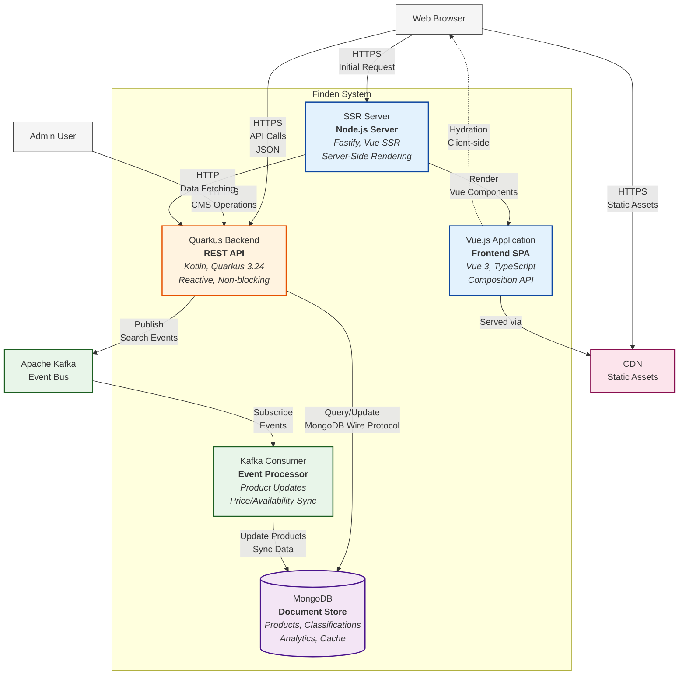

# Container Diagram - Finden Product Search System

## Overview

The Container diagram shows the high-level technical building blocks that make up the Finden system and how they interact. Each container represents a separately deployable/runnable component with its own technology stack.

## Container Diagram

## Container Descriptions

### Frontend Layer

#### Vue.js Application (SPA)
- **Technology**: Vue.js 3.2, TypeScript, Vuex, Vue Router
- **Purpose**: Interactive user interface for product search and filtering
- **Key Features**:
  - Composition API for reactive state management
  - Component-based architecture
  - Client-side routing
  - Progressive enhancement
- **Components**:
  - Product listing views (`ProduktlisteView`, `MiniProduktlisteView`)
  - Product components (`Produktkachel`, `Produktfilter`)
  - Filter components (`Filterwerte`, `FilterTag`)
  - Design system components (`B2kButton`, `B2kIcon`)
- **Communication**: REST API calls to backend, WebSocket for real-time updates (future)

#### SSR Server (Server-Side Rendering)
- **Technology**: Node.js, Fastify 4.2, Vue Server Renderer
- **Purpose**: Server-side rendering for SEO and initial page load performance
- **Key Features**:
  - Pre-renders Vue components on server
  - Optimizes initial page load
  - Provides better SEO
  - Handles hydration process
- **Endpoints**:
  - `/` - Main product listing page
  - `/health` - Health check endpoint
  - `/metrics` - Prometheus metrics
- **Performance**: Caching strategies for rendered pages

### Backend Layer

#### Quarkus Backend (REST API)
- **Technology**: Kotlin 2.2, Quarkus 3.24, MongoDB Panache
- **Purpose**: Business logic, data access, and API services
- **Architecture**: Onion/Hexagonal with DDD principles
- **API Endpoints**:
  - `/api/v1/products` - Product search and filtering
  - `/api/v1/filters` - Available filter options
  - `/api/v1/classifications` - Category hierarchy
  - `/api/tools/produktliste` - Admin tools
- **Key Features**:
  - Reactive programming model
  - Non-blocking I/O
  - GraalVM native compilation support
  - OpenAPI documentation
- **Security**:
  - Input validation and sanitization
  - Rate limiting
  - CORS configuration
  - Role-based access (admin features)

#### Kafka Consumer (Event Processor)
- **Technology**: Quarkus Kafka, Confluent Avro
- **Purpose**: Process events from external systems
- **Event Types Consumed**:
  - `product.created/updated/deleted` - Product catalog changes
  - `pricing.changed` - Price updates
  - `availability.changed` - Stock updates
- **Processing Strategy**:
  - At-least-once delivery
  - Idempotent operations
  - Dead letter queue for failures
- **Integration**: Direct MongoDB updates for data synchronization

### Data Layer

#### MongoDB (Document Store)
- **Version**: MongoDB 4.4+
- **Purpose**: Primary data storage for all product-related data
- **Collections**:
  - `products` - Main product catalog
    - Indexes: `klassifikationId`, `price`, `text search`
  - `classifications` - Category hierarchy
    - Indexes: `parentId`, `active`
  - `search_analytics` - Search behavior tracking
  - `availability_cache` - Cached availability data
- **Features Used**:
  - Full-text search capabilities
  - Aggregation pipelines for complex queries
  - Change streams for real-time updates (future)
  - WiredTiger storage engine for compression

### Infrastructure Services

#### CDN (Content Delivery Network)
- **Purpose**: Static asset delivery and caching
- **Content Types**:
  - JavaScript bundles (Vue application)
  - CSS stylesheets
  - Product images
  - Font files
- **Caching Strategy**:
  - Long-term caching with versioned URLs
  - Compression (gzip/brotli)
  - Geographic distribution

## Inter-Container Communication

### Synchronous Communication

#### Browser ↔ Backend API
- **Protocol**: HTTPS REST
- **Format**: JSON
- **Patterns**:
  - Request/Response for searches
  - Pagination for large result sets
  - Filter state in query parameters
- **Security**: CORS, rate limiting

#### SSR Server → Backend API
- **Protocol**: HTTP (internal)
- **Purpose**: Initial data fetching for SSR
- **Optimization**: Connection pooling, keep-alive

#### Backend API → MongoDB
- **Protocol**: MongoDB Wire Protocol
- **Driver**: MongoDB Panache Kotlin
- **Patterns**:
  - Repository pattern abstraction
  - Reactive streams
  - Connection pooling

### Asynchronous Communication

#### Kafka → Kafka Consumer
- **Protocol**: Kafka protocol
- **Format**: Avro with schema registry
- **Patterns**:
  - Consumer groups for scaling
  - Offset management
  - Error handling with retries

#### Backend API → Kafka
- **Purpose**: Publish search analytics events
- **Events Published**:
  - `search.performed` - Search queries and results
  - `filter.applied` - Filter usage analytics
- **Format**: Avro schemas

## Technology Stack Details

### Frontend Technologies
- **Framework**: Vue.js 3.2 with Composition API
- **Language**: TypeScript (strict mode)
- **State Management**: Vuex 4.0
- **Routing**: Vue Router 4.0
- **HTTP Client**: Axios
- **Build Tools**: Vue CLI, Webpack
- **Testing**: Jest, Vue Test Utils

### Backend Technologies
- **Framework**: Quarkus 3.24 (Supersonic Subatomic Java)
- **Language**: Kotlin 2.2
- **Database ORM**: MongoDB Panache Kotlin
- **Messaging**: Quarkus Kafka, Confluent Avro
- **Security**: Elytron security
- **Monitoring**: Micrometer, Prometheus
- **Testing**: JUnit 5, TestContainers, ArchUnit

### DevOps Technologies
- **Containerization**: Docker
- **Orchestration**: Kubernetes
- **CI/CD**: GitLab CI
- **Infrastructure as Code**: Terraform
- **Monitoring**: Prometheus, Stackdriver
- **Logging**: Structured JSON logging

## Data Flow Scenarios

### Product Search Flow
1. User enters search term in Vue.js app
2. Vue app sends REST request to Backend API
3. Backend API queries MongoDB with text search
4. MongoDB returns matching products
5. Backend API enriches and transforms data
6. Response sent back to Vue app
7. Vue app renders product grid

### Product Update Flow
1. Product Management System publishes event to Kafka
2. Kafka Consumer receives product update event
3. Consumer validates and transforms data
4. Consumer updates MongoDB directly
5. Next search query returns updated data

### Server-Side Rendering Flow
1. Browser requests page from SSR Server
2. SSR Server fetches data from Backend API
3. SSR Server renders Vue components with data
4. HTML sent to browser with embedded state
5. Vue app hydrates on client side
6. Subsequent interactions use client-side routing

---

*The Container diagram provides the technical architecture view. For detailed component design, see the [Component Diagram](./components.md).*