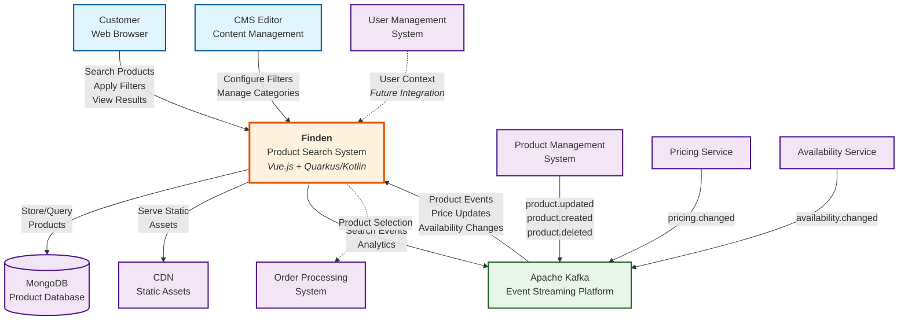

# System Context - Finden Product Search System

## Overview

The System Context diagram shows how the Finden system fits into the broader e-commerce ecosystem. As a Self-Contained System (SCS), Finden provides product search and filtering capabilities while maintaining clear boundaries with other systems.

## System Context Diagram

## Actors and Systems

### Primary Users

#### Customer (End User)
- **Description**: Online shoppers browsing for products
- **Interaction**: Web-based interface for searching, filtering, and viewing products
- **Key Actions**:
  - Full-text product search
  - Filter by categories, price, availability, colors
  - View product details and images
  - Navigate to product detail pages

#### CMS Editor
- **Description**: Content managers maintaining product categories and filters
- **Interaction**: Administrative interface for content management
- **Key Actions**:
  - Configure product classifications
  - Manage filter options
  - Set up category hierarchies
  - Define sorting options

### External Systems

#### Product Management System
- **Responsibility**: Master data for product catalog
- **Integration**: Event-driven via Kafka
- **Events Published**:
  - `product.created` - New products added
  - `product.updated` - Product information changes
  - `product.deleted` - Products removed
- **Data Shared**: Product details, descriptions, classifications, images

#### Pricing Service
- **Responsibility**: Dynamic pricing and promotions
- **Integration**: Event-driven via Kafka
- **Events Published**:
  - `pricing.changed` - Price updates, discounts
- **Data Shared**: Current prices, strike-through prices, currency information

#### Availability Service
- **Responsibility**: Stock levels and delivery information
- **Integration**: Event-driven via Kafka
- **Events Published**:
  - `availability.changed` - Stock updates, delivery dates
- **Data Shared**: Stock status, delivery regions, delivery days

#### User Management System
- **Responsibility**: User authentication and profiles
- **Integration**: Future integration planned
- **Potential Features**: Personalized search, saved filters, search history

#### Order Processing System
- **Responsibility**: Shopping cart and checkout
- **Integration**: Loose coupling via product selection
- **Data Flow**: Product selections passed to order processing

### Infrastructure Components

#### Apache Kafka
- **Purpose**: Event streaming and asynchronous communication
- **Topics Used**:
  - Product updates
  - Pricing changes
  - Availability updates
  - Search analytics
- **Benefits**: Decoupling, scalability, event sourcing

#### MongoDB
- **Purpose**: Primary data store for products
- **Collections**:
  - `products` - Product catalog
  - `classifications` - Category hierarchy
  - `search_analytics` - Search metrics
  - `availability_cache` - Cached availability data
- **Features**: Full-text search, aggregation pipelines, sharding support

#### CDN (Content Delivery Network)
- **Purpose**: Static asset delivery
- **Content Served**:
  - JavaScript bundles
  - CSS stylesheets
  - Product images
  - Frontend assets
- **Benefits**: Performance, global distribution, caching

## System Boundaries

### Within Finden's Boundary
- Product search and filtering logic
- Search result presentation
- Filter management and configuration
- Product data synchronization
- Search analytics collection
- Frontend application serving

### Outside Finden's Boundary
- User authentication and authorization
- Payment processing
- Order management
- Product master data management
- Inventory management
- Pricing calculations
- Shipping and logistics

## Key Characteristics

### Autonomy
- **Data Ownership**: Maintains its own product database
- **UI Ownership**: Complete frontend application
- **Business Logic**: All search and filter logic self-contained
- **Deployment**: Independent deployment lifecycle

### Integration Patterns
- **Event-Driven**: Asynchronous updates via Kafka
- **Eventually Consistent**: Accepts delayed synchronization
- **Read-Heavy**: Optimized for search queries
- **Cache-First**: Aggressive caching strategies

### Security Boundaries
- **Public Access**: Search functionality available without authentication
- **Administrative Access**: CMS features require authentication
- **Data Protection**: No personal data storage (GDPR compliant)
- **API Security**: Rate limiting and input validation

## Business Context

### Business Goals
1. **Fast Product Discovery**: Enable customers to quickly find desired products
2. **Flexible Filtering**: Support complex filter combinations
3. **Scalable Search**: Handle high query volumes
4. **Real-time Updates**: Reflect inventory and price changes quickly
5. **Analytics Insights**: Provide search behavior analytics

### Quality Attributes
- **Performance**: Sub-300ms search response times
- **Availability**: 99.9% uptime target
- **Scalability**: Horizontal scaling capability
- **Maintainability**: Clear separation of concerns
- **Reliability**: Graceful degradation under load

---

*The System Context provides the foundation for understanding Finden's role in the larger ecosystem. For technical details, proceed to the [Container Diagram](./containers.md).*